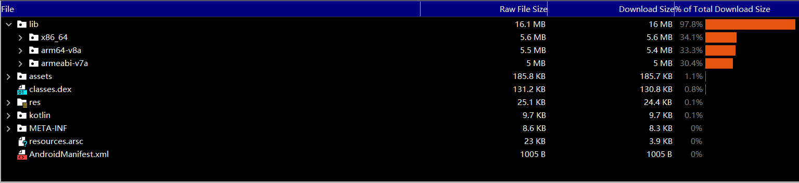
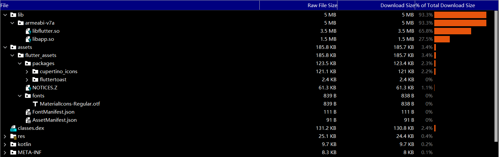

## ReFlutterNote(逆向flutter笔记)

### 前言

鉴于目前越来越多软件采用flutter进行开发，导致逆向安全难度增大。
所以在连续分析了一些颜色APP软件之后，我准备分享一些相关的逆向知识。做抛砖引玉之用。

### 章节目录

>所有内容都是以release版本为逆向对象，debug版本没啥看的。没有人会发布debug版本的软件到应用市场。

>年底业务繁忙，工程笔记慢速施工当中。

#### [0.flutter 的基本开发](https://github.com/HuRuWo/ReFlutterNote/blob/main/note/000.md)

#### 1.flutter apk结构

在前面的基本开发过程中,我们得到了一个较为简单的flutter apk 文件。现在我们来将其解析分析里面包含的文件内容。


```
F:\flutter\bin\flutter.bat --no-color build apk
Running Gradle task 'assembleRelease'...                          114.7s
√  Built build\app\outputs\flutter-apk\app-release.apk (16.5MB).
Process finished with exit code 0
```

整个apk大小挺恐怖的，我们之前只写了几行代码几个类居然有16.5MB的大小。



原因是在lib里面用了三套架构，我们只保留一套即可

```
defaultConfig {
        // TODO: Specify your own unique Application ID (https://developer.android.com/studio/build/application-id.html).
        applicationId "com.example.fluttertest"
        minSdkVersion 16
        targetSdkVersion 30
        versionCode flutterVersionCode.toInteger()
        versionName flutterVersionName

        ndk {
            abiFilters "armeabi-v7a" //架构保留
        }

    }
```

```
F:\flutter\bin\flutter.bat --no-color build apk

 Building with sound null safety 

Running Gradle task 'assembleRelease'...                            5.4s
√  Built build\app\outputs\flutter-apk\app-release.apk (5.4MB).
Process finished with exit code 0
```

这下我们的apk只有5.4M



关于flutter的部分在

lib asset 两个文件夹里面，asset存放的就是相关的资源文件而lib里面就存放了我们要破解的flutter的代码。

- libflutter.so 完整的flutter虚拟机

- libapp.so     flutter程序代码对应的dart vm AOT 快照文件


#### 2.flutter 虚拟机架构


#### 3.flutter AOT 快照文件格式

#### 4.flutter 数据包抓取方式

#### 5.flutter SDK 引擎编译

#### 6.flutter SDK 引擎注入重打包

#### 7.flutter AOT快照解析

#### 8.flutter function code 定位

#### 9.flutter function code 修改

#### 10.flutter frida hook

#### 11.flutter frida xposed hook

#### 12.flutter dart 算法还原

#### 13.flutter 更多相关知识点 

## 最后


如有有需求的可以帮忙点点start让我知道有人在看。我会更快的抽出时间来更新教程。

如果有帮助,各位手动点点start即可。有问题直接issue讨论或者gitchat联系我。


